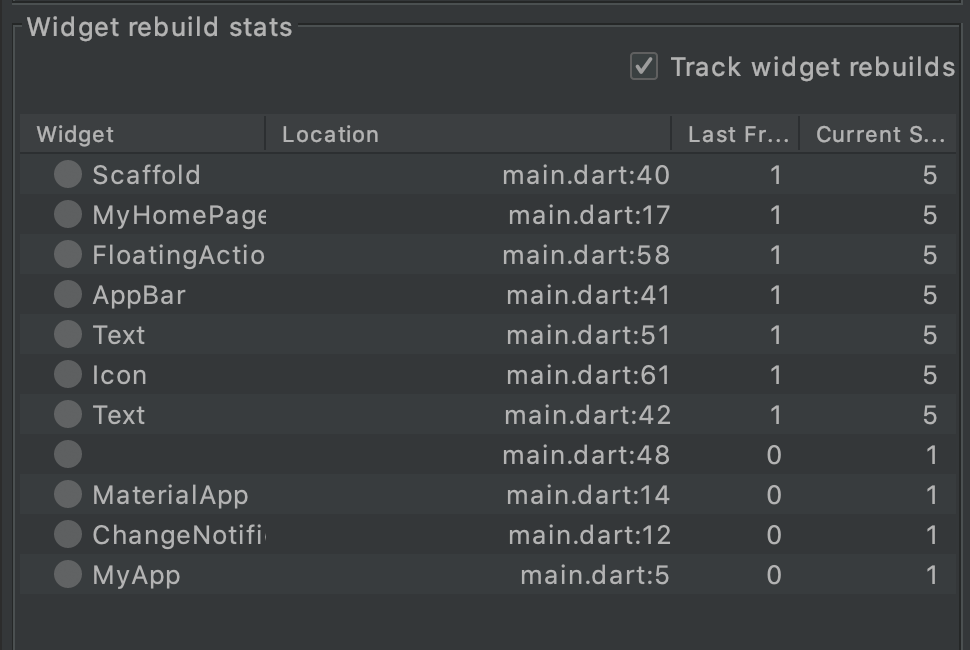

# flutter_app

Flutter Architecture Sample Repository

## ChangeNotifierProviderスタイル+Builder局所化

* MaterialAppの外側でProviderを書かないとpushしたときにcontextからみつからなくなる
* Builderで囲って局所的に書き換わるようにした
* まぁまぁのパフォーマンス
